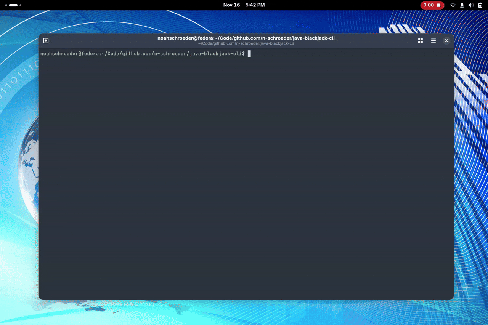

# ♠️ Java Blackjack CLI

> A clean, object-oriented Blackjack game built from scratch in Java.
>
> **Project Stats:** ~6 hour build | Pure Java | Zero Dependencies

This project was built to practice core Object-Oriented Programming (OOP) principles and as a Barrett Honors Contract for my CSE 110 class.

---

## System Architecture

I designed this project to be modular and extensible, moving away from "spaghetti code" in a single `main` method. The architecture relies on strict separation between data (Cards/Decks) and logic (Game/Hand).

### Class Structure
* **`Suit` & `Rank` (Enums)**
  * Defines the immutable properties of a playing card.
  * Used Enums to ensure type safety and prevent invalid card generation.
* **`Card`**
  * The fundamental unit of the game. Encapsulates a `Suit` and `Rank` and provides a readable `toString()` representation \("\[ACE of SPADES]").
* **`Deck`**
  * Manages the collection of 52 `Card` objects.
  * Handles stateful actions like `shuffle()` (using `Collections.shuffle`) and `deal()`.
* **`Hand`**
  * Represents the player or dealer's current cards.
  * **Key Logic:** Dynamic calculation of hand value, specifically handling the edge case where an Ace can be worth 1 or 11 depending on the total.
* **`BlackjackGame`**
  * Manages the game loop, user input, and win/loss conditions.

---

## How to Play

You must have the Java Development Kit (JDK) installed on your computer to run this game.

**1. Clone the Repository:**
```bash
git clone https://github.com/n-schroeder/java-blackjack-cli.git
```

**2. Navigate to the Directory:**
```bash
cd java-blackjack-cli
```

**3. Compile the Java Files:**
```bash
javac *.java
```

**4. Run the Game:**
```bash
java BlackjackGame
```

## Features

* **Standard Blackjack Rules:** Play against the automated dealer.
* **Player Actions:** Hit or Stand.
* **Dealer Logic:** The dealer automatically hits until their hand value is 17 or higher.
* **Ace Handling:** Aces are correctly valued at 1 or 11.
* **Busts & Blackjacks:** The game automatically detects bust, win, and "Push" (tie) conditions.

---

## Key Takeaways

* **Encapsulation:** Keeping internal state (like the cards in a deck) private and only exposing necessary methods (deal()).
* **Enums vs Constants:** Using Java Enums for Suit and Rank creates much safer code than using integer constants (e.g., int HEARTS = 1).
* **Algorithmic Logic:** Implementing the "Ace value" algorithm (11 unless total > 21 && aceCount >= 1, then 1) taught me about conditional state management.

---

## Game in Action (GIF)

